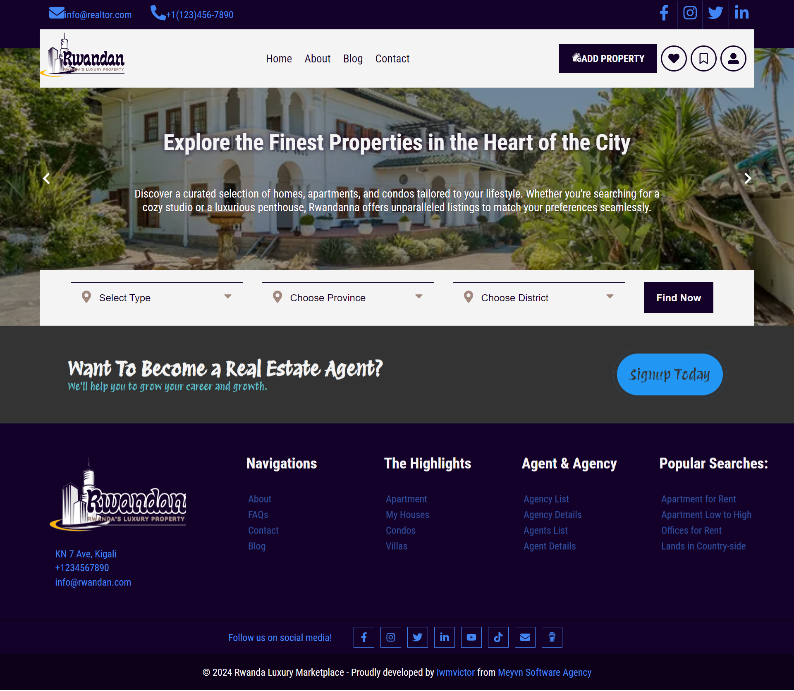

# RWANDANNA - Rwandan Luxury Properties Listing

Welcome to the React Vite Real Estate platform! 🏡 Discover a cutting-edge real estate website built using React.js with Vite. This platform caters to both clients looking to view, rent, or buy properties and agents, brokers, and agencies eager to list their offerings.

## Features
- User-friendly interface for clients to explore listed properties
- Seamless property listing for agents, brokers, and agencies
- Advanced search and filtering options for property selection
- Responsive design for optimal user experience on all devices

## Preview

[See the live demo](https://rwandanna.netlify.app/) to experience React Vite Real Estate in action.

## Getting Started
1. Clone this repository to your local machine.
2. Navigate to the project folder and run `npm install` to install dependencies.
3. Run `npm dev` to start the Vite development server.
4. Open your browser and go to `http://localhost:3000` to explore the Real Estate platform.

## Project Structure
- `src/components/`: React components for various sections.
- `src/pages/`: Individual pages for different views.
- `src/styles/`: Styling files for the components and layout.
- `src/utils/`: Utility functions and helper files.
- `vite.config.js`: Vite configuration file.

## Demo
[See the live demo](https://rwandanna.netlify.app/) to experience React Vite Real Estate in action.

## Contribution
Feel free to contribute, report issues, or suggest improvements. We welcome your input!

## Connect with Us
🌐 [Follow us on Instagram](https://www.instagram.com/meyvndev)
🐦 [Tweet us on Twitter](https://twitter.com/meyvnagency)
📺 [Subscribe to our YouTube channel](https://youtube.com/@wearemeyvn)
📧 [Email: info.meyvn@gmail.com](mailto:info.meyvn@gmail.com)

Elevate your real estate experience with React Vite Real Estate! 🌐
